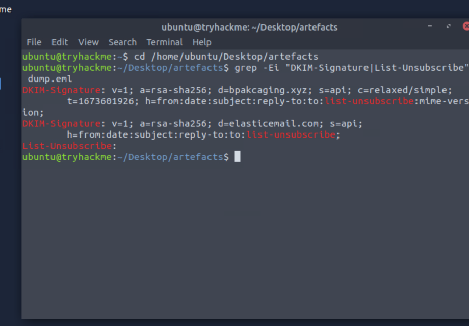
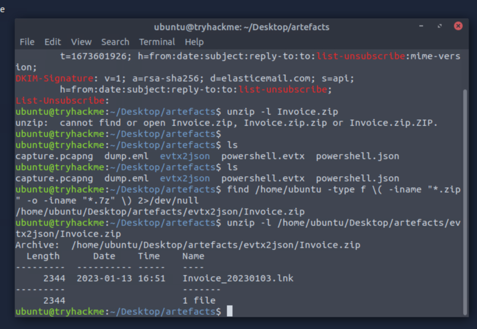
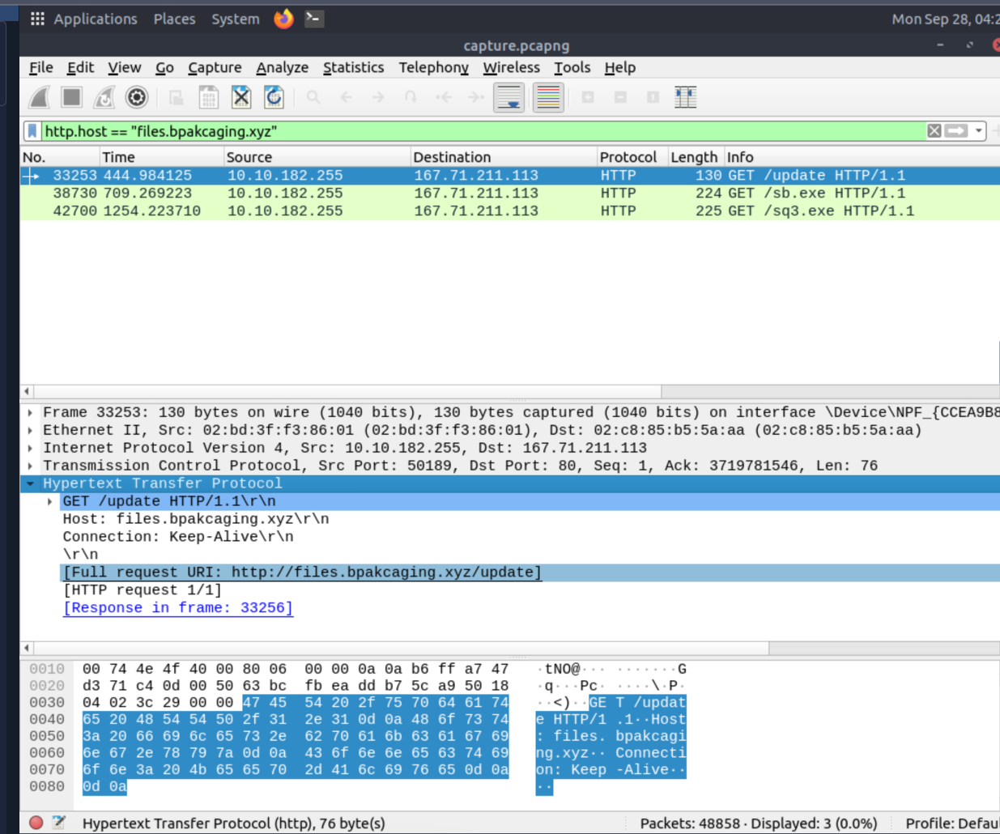

# Boogeyman 1 Investigation

## Overview

This case study documents my investigation of the Boogeyman 1 incident as part of the TryHackMe SOC Level 1 learning path.

The investigation focused on analysing a phishing attack, identifying malicious activity, tracing command-and-control communication, and investigating data exfiltration.

## Scenario

A user received a malicious phishing email containing an encrypted attachment.

The investigation required analysing the email, identifying the malicious payload, reviewing PowerShell activity, and examining network traffic generated by the compromised system.

## Data Sources

- Phishing email
- PowerShell logs
- Network packet capture (PCAP)

## Tools Used

- Email analysis tools
- PowerShell log analysis
- Wireshark
- Network traffic analysis

## Investigation Summary

### 1. Phishing Email Analysis

The investigation began by examining the suspicious email and its attachment.

Email metadata and attachment information were reviewed to determine how the malicious file was delivered.


### 2. Malicious Attachment Analysis

The attachment was password-protected and contained a malicious payload.

The attacker used the document as the initial delivery mechanism for further execution on the victim workstation.





### 3. Command and Control

PowerShell and network evidence revealed communication with attacker-controlled infrastructure.

HTTP traffic was used to retrieve additional payloads and exchange command output with the command-and-control infrastructure.



### 4. Host Reconnaissance

The attacker performed system enumeration after gaining access to the workstation.

This activity included gathering information about the host and accessing locally stored application data.

### 5. Data Exfiltration

The attacker identified sensitive data and attempted to exfiltrate it using network traffic.

Analysis of the packet capture helped identify the exfiltration technique and reconstruct the activity.

## Attack Chain

```text
Phishing Email
      ↓
Malicious Attachment
      ↓
PowerShell Execution
      ↓
Payload Download
      ↓
Command and Control
      ↓
Host Reconnaissance
      ↓
Sensitive Data Discovery
      ↓
Data Exfiltration

```
Key Skills Practiced
- Phishing email analysis
- PowerShell log analysis
- HTTP traffic investigation
- PCAP analysis
- Command-and-control identification
- Data exfiltration analysis
- Incident reconstruction
Key Takeaways
This investigation demonstrated how phishing, endpoint activity, and network traffic can be correlated to reconstruct an attack.
It also reinforced the importance of analysing multiple evidence sources rather than relying on a single log or alert.
