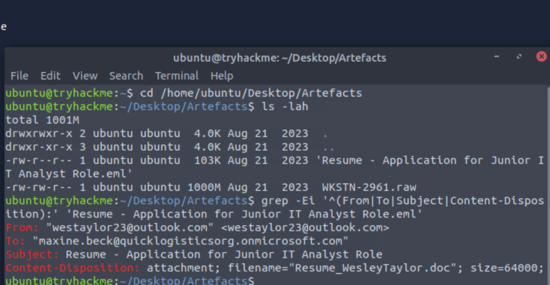
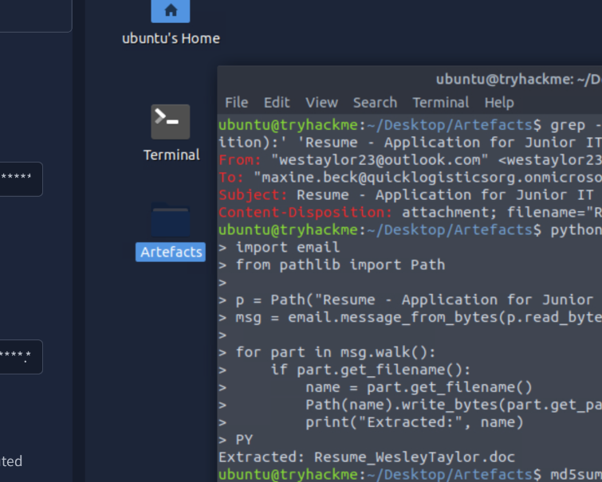
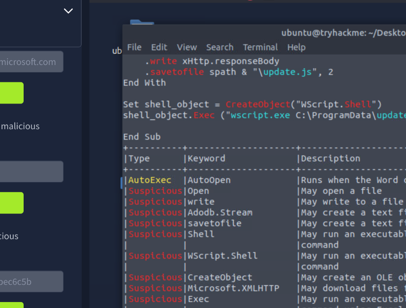
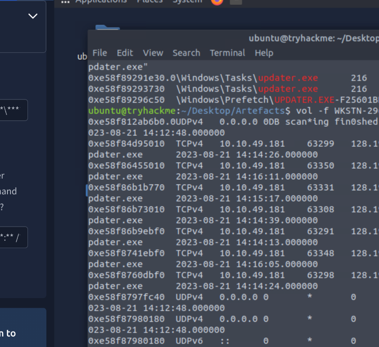
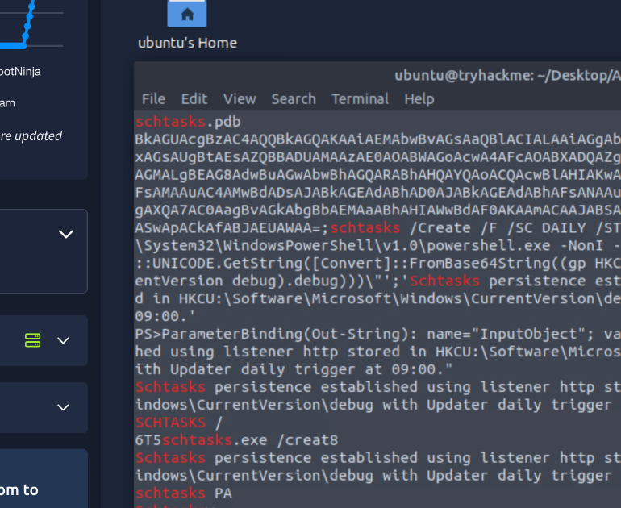

# Boogeyman 2 Investigation

## Overview

This case study documents my investigation of the Boogeyman 2 incident as part of the TryHackMe SOC Level 1 learning path.

The investigation focused on phishing analysis, malicious document analysis, memory forensics, process investigation, command-and-control activity, and persistence.

## Scenario

A Human Resources employee received a malicious resume attachment through email.

The attached Microsoft Word document contained a malicious macro that downloaded and executed a second-stage payload.

The investigation used the phishing email, malicious document, and a memory dump of the compromised workstation to reconstruct the attack.

## Data Sources

- Phishing email
- Microsoft Word document
- Windows memory dump

## Tools Used

- Volatility
- Olevba
- Linux command-line tools
- Memory forensics techniques

## Investigation Summary

### 1. Phishing Email Analysis

The investigation began by examining the suspicious email.

Email metadata was analysed to identify the sender, recipient, subject, and malicious attachment.



### 2. Attachment Verification

The malicious attachment was extracted from the email and its MD5 hash was calculated to verify the file being investigated.



### 3. Malicious Macro Analysis

The Microsoft Word document was analysed using Olevba.

The macro revealed that the document downloaded a second-stage payload and executed it using a Windows scripting process.



### 4. Process Analysis

The memory dump was analysed using Volatility to reconstruct the execution chain.

Process relationships helped identify:

- The process responsible for executing the second-stage payload
- The PID of the malicious process
- The parent PID
- The location of the malicious executable

This demonstrated how process relationships can be used to trace malicious execution inside a compromised system.

### 5. Command and Control

Network artefacts recovered from memory showed that the malicious executable established repeated outbound connections to attacker-controlled infrastructure.

The connection information was identified by correlating the malicious process with network activity.



### 6. Persistence

The attacker established persistence using a Windows Scheduled Task.

Evidence recovered from memory showed that PowerShell was configured to execute automatically, allowing the attacker to maintain access to the compromised workstation.



## Attack Chain

```text
Phishing Email
      ↓
Malicious Resume Attachment
      ↓
VBA Macro Execution
      ↓
Stage 2 Payload Download
      ↓
Script Execution
      ↓
Malicious Executable
      ↓
Command and Control
      ↓
Scheduled Task Persistence
```
Key Skills Practiced
- Phishing email analysis
- VBA macro analysis
- Memory forensics
- Process analysis
- PID and parent process correlation
- Network connection analysis
- Command-and-control investigation
- Persistence analysis
- Attack chain reconstruction
Key Takeaways
This investigation demonstrated how memory forensics can reveal important evidence that may not be available in traditional log files.
By combining email analysis, macro inspection, process relationships, network artefacts, and persistence evidence, I was able to reconstruct the compromise from initial delivery to persistent access.
