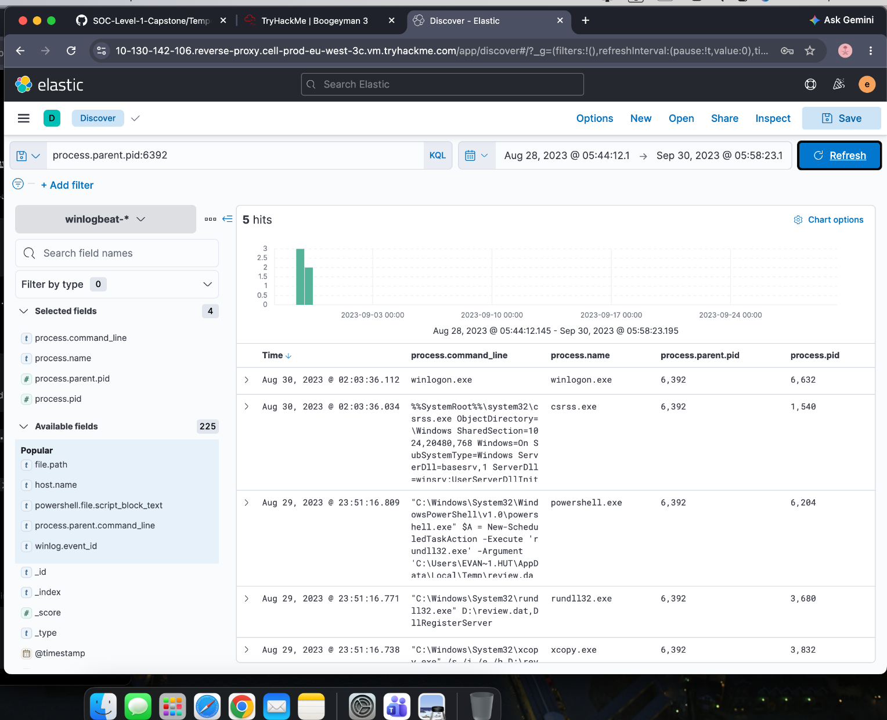
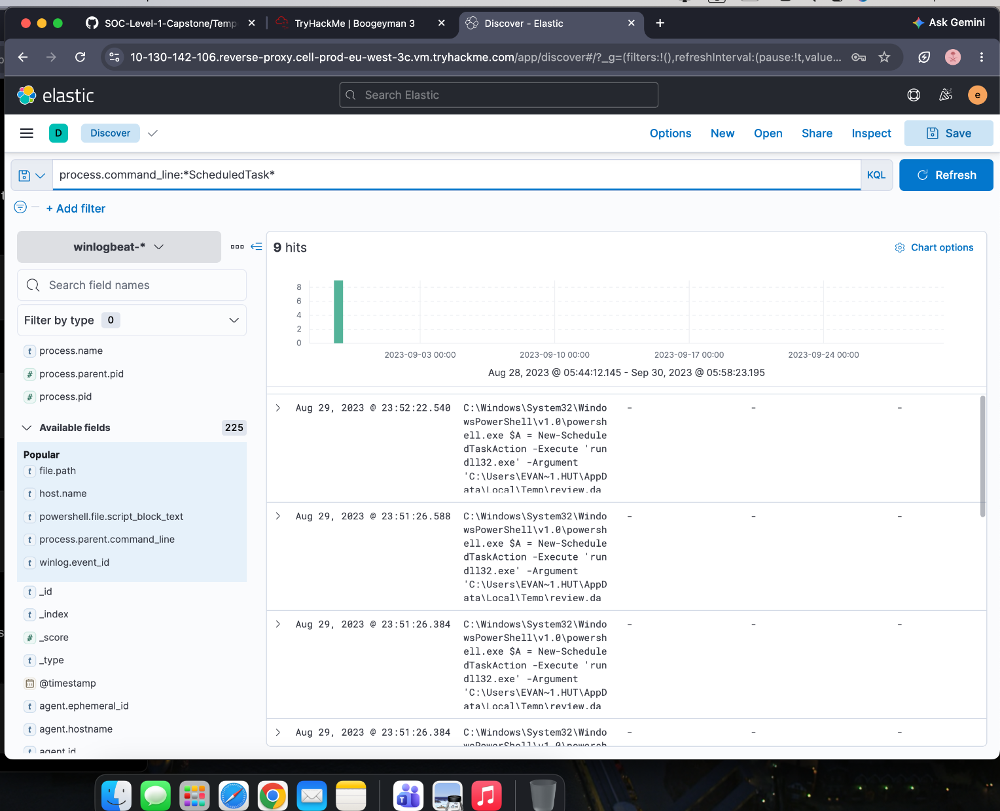
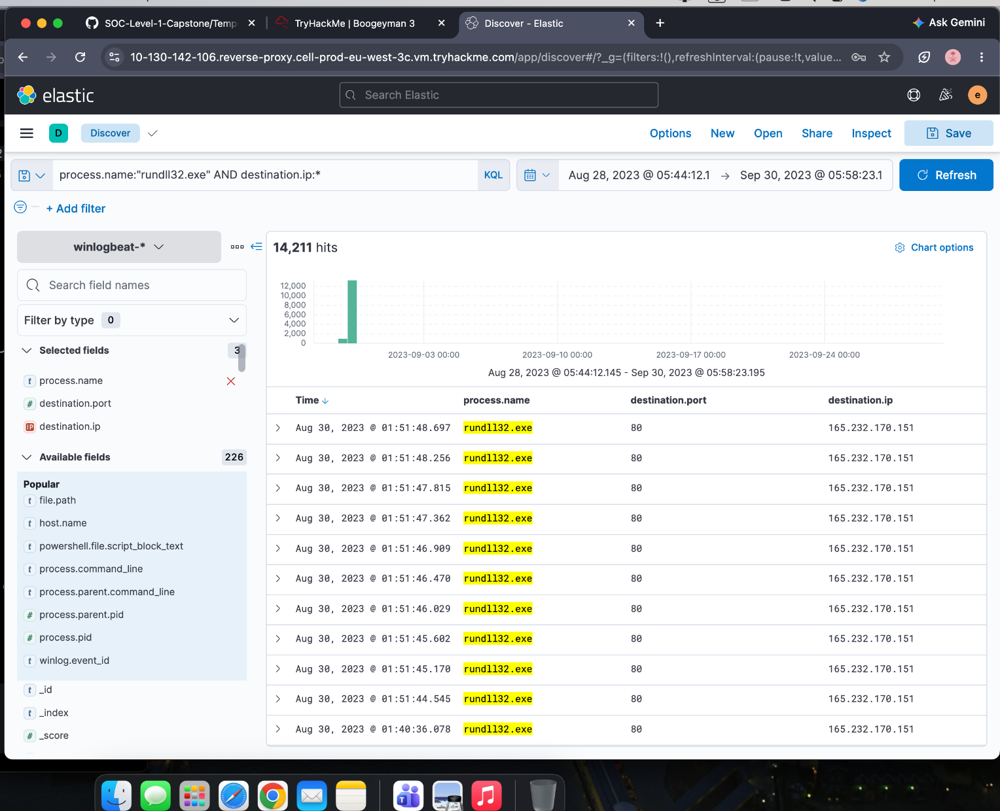
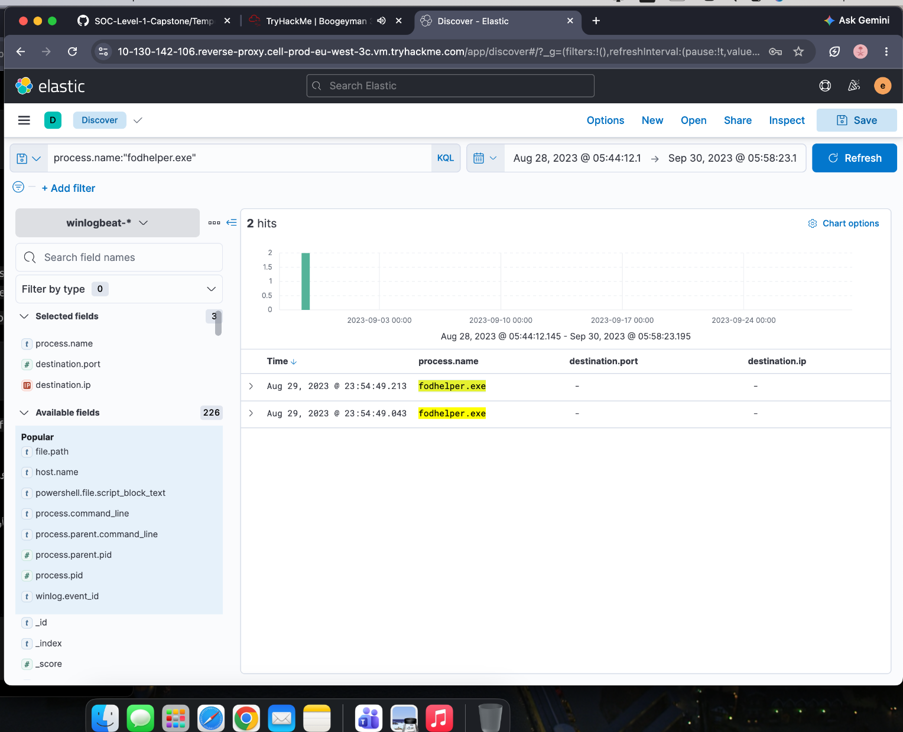
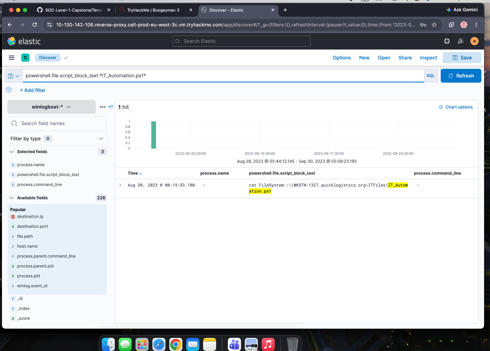
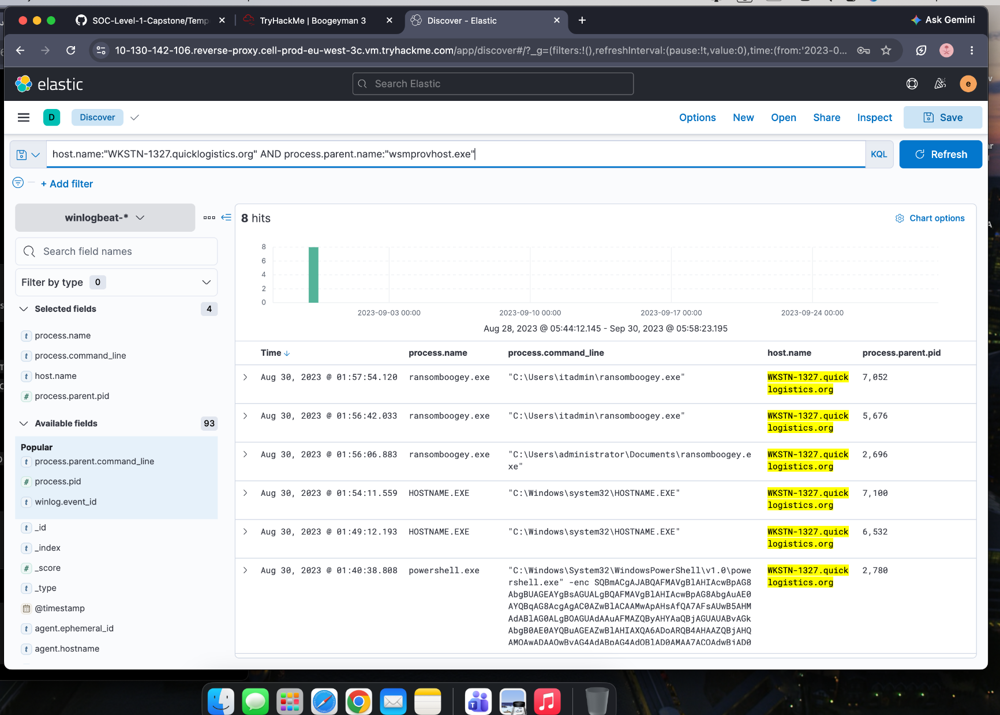
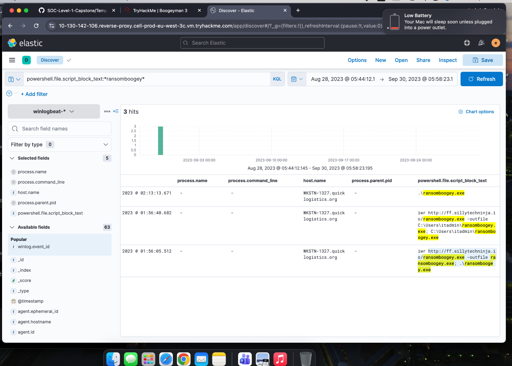

# Boogeyman 3 Investigation

## Overview

This case study documents my investigation of the Boogeyman 3 incident as part of the TryHackMe SOC Level 1 learning path.

The investigation focused on analysing endpoint and PowerShell telemetry in Elastic, reconstructing the attack chain, and identifying persistence, command-and-control, privilege escalation, credential access, lateral movement, and ransomware activity.

## Scenario

A phishing attachment was opened by the CEO of Quick Logistics LLC.

Although the attachment appeared to do nothing, endpoint telemetry revealed that the attacker successfully executed a multi-stage attack and later expanded access across the environment.

## Data Source

- Windows endpoint telemetry
- PowerShell logs
- Process creation events
- Network connection events
- Elastic / Kibana logs

## Tools Used

- Elastic Stack
- Kibana Discover
- KQL
- Windows process analysis
- PowerShell log analysis

## Investigation Summary

### 1. Initial Execution

The investigation began by tracing the process responsible for executing the first-stage payload.

Process relationships revealed additional commands used to copy and execute the implanted payload.



### 2. Persistence

The attacker used PowerShell to create a scheduled task, allowing malicious code to execute again automatically.



### 3. Command and Control

Network telemetry showed repeated outbound HTTP communication from the malicious process to attacker-controlled infrastructure.



### 4. Privilege Escalation

The attacker identified that the compromised user had local administrator privileges and used a Windows process associated with a UAC bypass technique.



### 5. Credential Access

After gaining elevated privileges, the attacker downloaded and used credential-dumping tooling to obtain additional credentials from the compromised system.

These credentials were later used to expand access within the environment.

### 6. Remote Share Discovery

The attacker accessed a PowerShell automation file stored on a remote network share.

The contents of this file exposed information that enabled further lateral movement.



### 7. Lateral Movement

The attacker used the newly discovered credentials to access another workstation.

Process telemetry on the second host showed activity associated with PowerShell Remoting and WinRM.



### 8. Domain Credential Access

After compromising additional systems, the attacker performed further credential dumping and eventually used a DCSync technique against the domain environment.

This demonstrated that the compromise had progressed from a single workstation to domain-level credential access.

### 9. Ransomware Execution

During the final stage of the attack, PowerShell was used to download a ransomware executable to the compromised workstation.

The downloaded binary was subsequently executed.



## Attack Chain

```text
Phishing Attachment
        ↓
Stage 1 Execution
        ↓
Payload Implantation
        ↓
Scheduled Task Persistence
        ↓
Command and Control
        ↓
UAC Bypass
        ↓
Credential Dumping
        ↓
Remote Share Discovery
        ↓
Lateral Movement
        ↓
Additional Credential Access
        ↓
DCSync
        ↓
Ransomware Download and Execution
```
Key Skills Practiced
- Elastic / Kibana investigation
- KQL filtering
- Windows process analysis
- PowerShell telemetry analysis
- Process parent-child correlation
- Command-and-control investigation
- Persistence detection
- UAC bypass analysis
- Credential dumping investigation
- Remote share analysis
- Lateral movement detection
- DCSync investigation
- Ransomware activity analysis
- Attack chain reconstruction
Key Takeaways
This investigation demonstrated how endpoint telemetry can be used to reconstruct a complex multi-stage attack.
