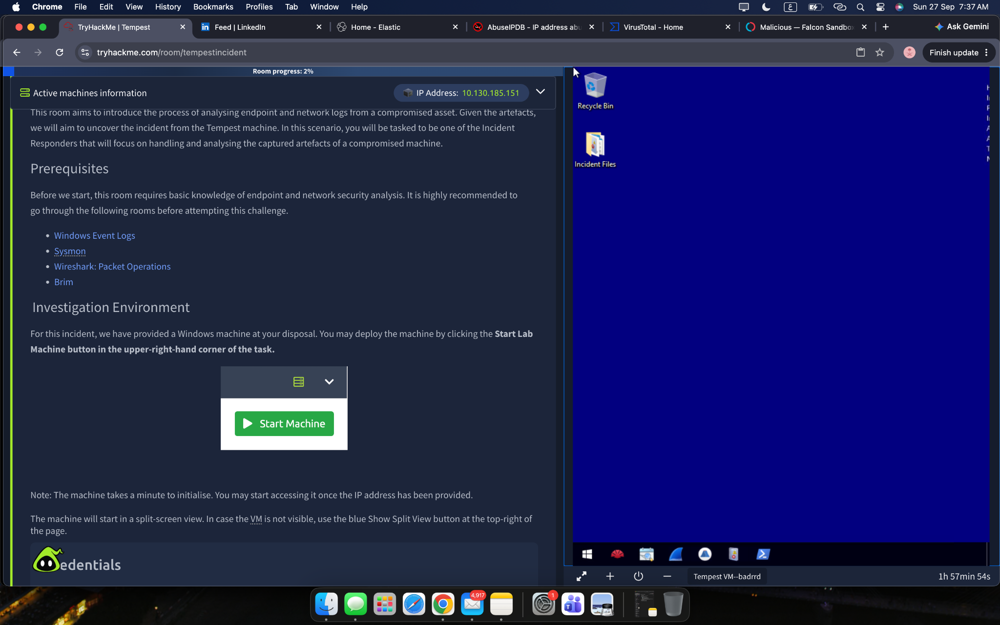
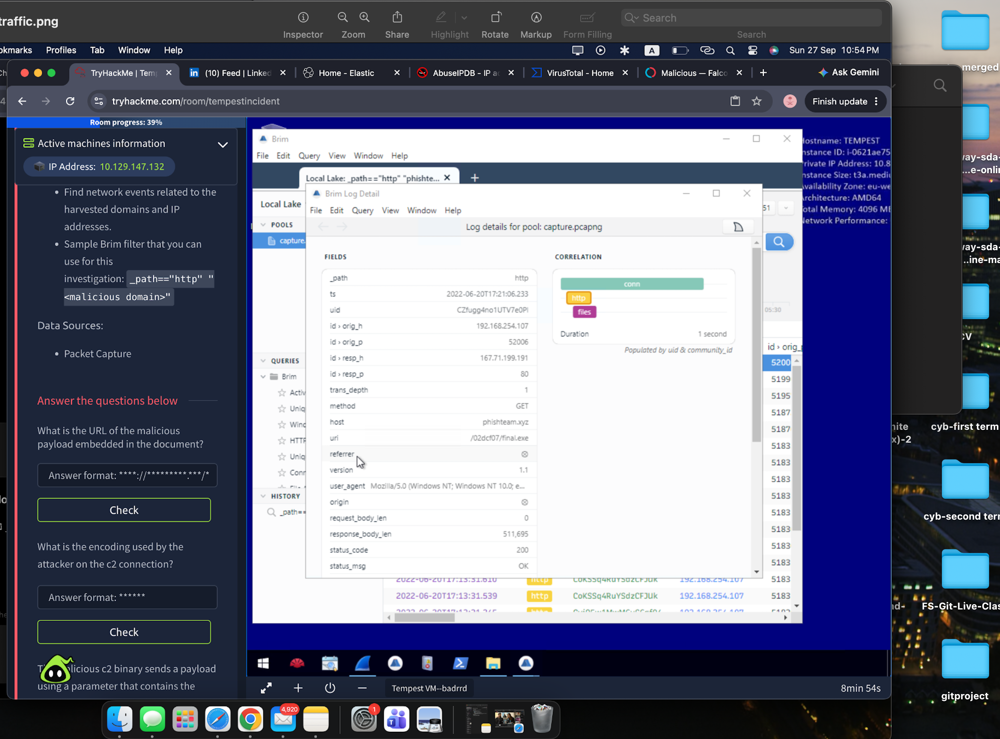
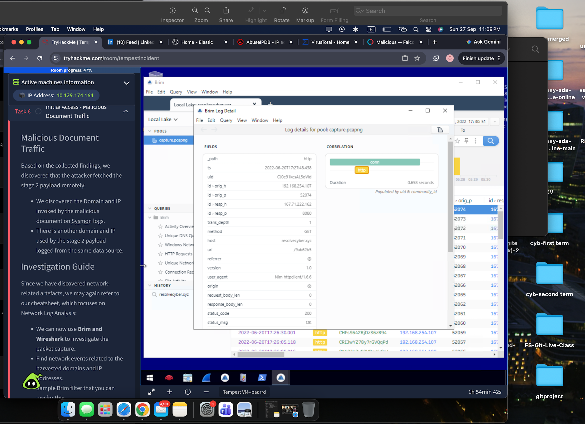

# Tempest Incident Response Investigation

## Overview

This case study documents my investigation of a compromised Windows endpoint during the Tempest SOC Level 1 capstone challenge.

The goal was to reconstruct the attack from initial access through command-and-control, internal reconnaissance, privilege escalation, and persistence.

## Scenario

A critical SOC alert indicated that a malicious Microsoft Word document had been downloaded and executed on a Windows host.

The investigation focused on correlating endpoint and network evidence to understand the full attack chain.


## Data Sources

- Windows Event Logs
- Sysmon
- Packet Capture (PCAP)

## Tools Used

- Event Viewer
- Brim
- Wireshark
- Timeline Explorer
- EvtxECmd
- SysmonView

## Investigation Summary

### 1. Initial Access
The attack began with a malicious Microsoft Word document downloaded through Google Chrome.

The document exploited CVE-2022-30190 (Follina) to achieve code execution.

### 2. Stage 2 Execution
The malicious document executed an encoded PowerShell command and downloaded an additional payload.

A persistence mechanism was established so the payload could execute again after user logon.

### 3. Command and Control
Network analysis identified HTTP traffic to attacker-controlled infrastructure.
The C2 communication used encoded data to exchange commands and command results.




### 4. Internal Reconnaissance
The attacker performed host and privilege enumeration, discovered credentials, and identified internal services.

### 5. Pivoting
The attacker used Chisel to establish a reverse SOCKS proxy and pivot through the compromised host.

### 6. Privilege Escalation
The attacker abused SeImpersonatePrivilege with PrintSpoofer to obtain SYSTEM-level privileges.

### 7. Persistence
After gaining SYSTEM privileges, the attacker established persistence by:

- Creating new local user accounts
- Adding an account to the local Administrators group
- Creating an automatically starting Windows service
- Maintaining command-and-control access
## Attack Chain

```text
Malicious Word Document
        ↓
CVE-2022-30190 Exploitation
        ↓
Stage 2 Payload
        ↓
Command and Control
        ↓
Internal Reconnaissance
        ↓
Credential Discovery
        ↓
Reverse SOCKS Proxy
        ↓
Privilege Escalation
        ↓
SYSTEM Access
        ↓
Persistence
```

## Key Skills Practiced

- Windows Event Log analysis
- Sysmon analysis
- PCAP investigation
- C2 traffic analysis
- Process relationship analysis
- Event correlation
- Privilege escalation analysis
- Persistence detection
- Attack timeline reconstruction

## Key Takeaways

This investigation reinforced the importance of correlating endpoint and network evidence instead of analyzing events in isolation.

By following process relationships, network traffic, privileges, and persistence activity, I was able to reconstruct the attack from initial compromise to full system control.

## Disclaimer

This repository contains my personal investigation notes and learning outcomes from a controlled cybersecurity training environment.

Challenge flags, credentials, and direct answers are intentionally excluded.
